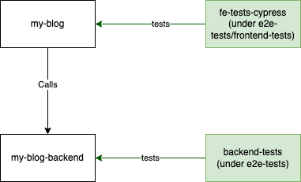

# Test as a Product - Demo
This is a demo project intended to show how Test as a Product can work. In this project we show how testBridge works.

We have the following parts:
* **my-blog** : A ReactJS project.
* **my-blog-backend** : A nodeJS-based micro-service.
* **e2e-tests/backend-tests** : A Java Project dedicated to testing the my-blog-backend apis.
* **e2e-tests/frontend-tests/fe-tests-cypress** : A cypress project dedicated to testing the front-end.



## Demo Deployment
In this chapter we help you start the demo project.

### Requirements
This project has been tested with the node versions:
* `v20.7.0`
* `v18.16.1`
* `v16.17.0` (Better avoid)

and Java versions:
* Java 18
* Java 11
* Java 8


### Deployment Order
There is a rough deployment order to get this project running:
1. Start the Back End
2. Testing the Back End
3. Start the my-blog app
4. Testing the front end

#### 1. Starting the Back-End
To start the backend :
1. Go to the directory `my-blog-backend`.
2. Install the dependencies `npm i`
3. Press `npm run dev`

Now you can test the system by running backend tests.

#### 2. Testing the Back-End
To run the backend tests:
1. go to project `e2e-tests/backend-tests/`
2. Run tests by entering `mvn clean test`

#### 3. Starting the Front-End
To start the front-end application:
1. Go to the directory `my-blog`.
2. Install the dependencies `npm i`
3. Press `npm run start`

Now you can test the system by running backend tests. But you can see that it is running with the url http://localhost:3000/.

#### 4. Front-end tests
In order to start the cypress tests:
1. go to project `e2e-tests/frontend-tests/fe-tests-cypress`
2. Install the dependencies `npm i`
3. `npm run cy:run`. Or simply open cypress for manually assited running `npx cypress open`.

### Activating the Bridge Service
To start the bridgeService go to the directory `e2e-tests/backend-tests/`, and press:

```mvn compile exec:java -Dexec.mainClass=MainContainer -Dexec.args="test"```

#### Testing the BridgeService
To see that the bridgeService is up you will need to try:

```curl http://localhost:8080/test```

This will let you know if the the bridgeService is up and running. 


Furthermore you can also press:

```
curl --request POST \
  --url http://localhost:8080/call \
  --header 'Content-Type: application/json' \
  --data '{
	"callContent": {
          "addComment": {
            "class": "com.bridgeservice.demo.backend.MyBlogBackEnd", 
            "method": "isSystemUp", 
            "args": ["http://localhost:8000/"]
          }
        }
}'
```

Here is another example:

```
curl --request POST \
  --url http://localhost:8080/call \
  --header 'Content-Type: application/json' \
  --data '{
	"callContent": {
          "addComment": {
            "class": "com.bridgeservice.demo.backend.MyBlogBackEnd", 
            "method": "fetchArticle", 
            "args": ["http://localhost:8000/", "learn-swedish"]
          }
        }
}'
```

